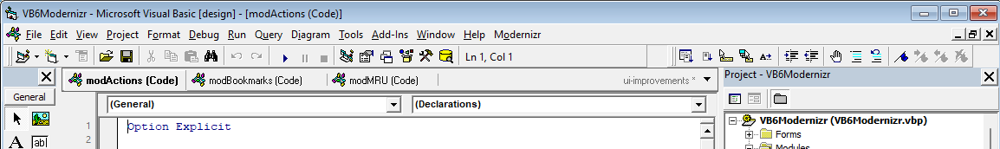
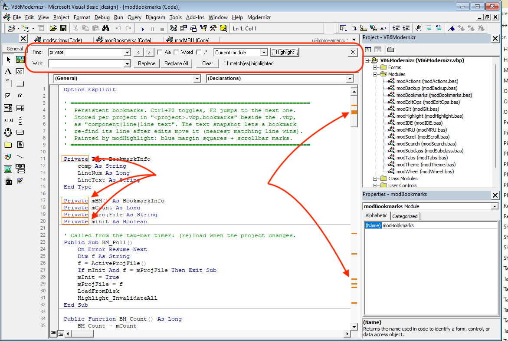
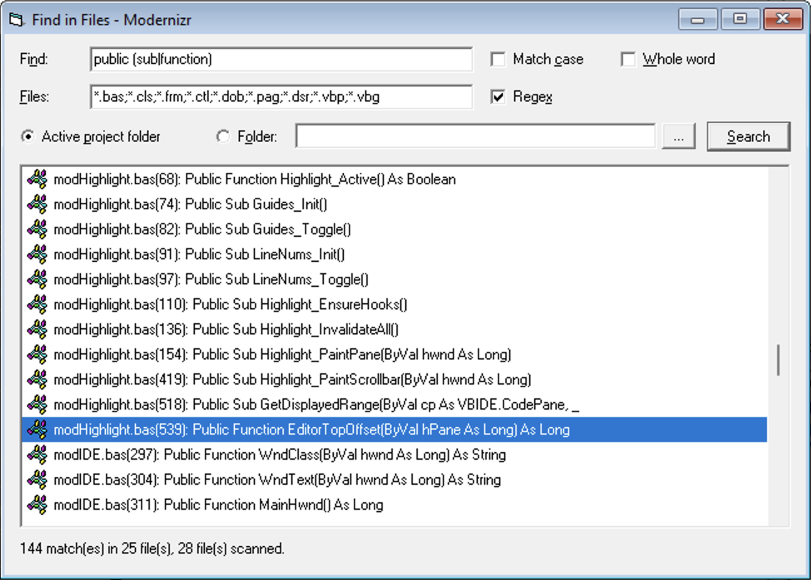
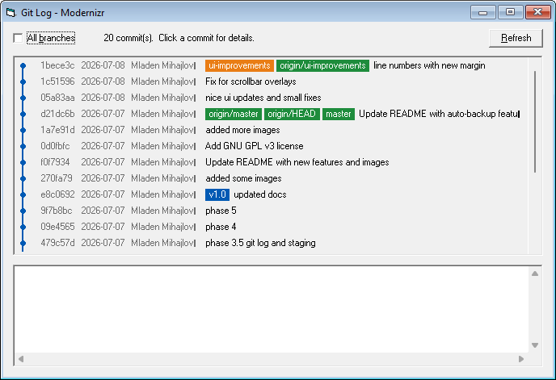
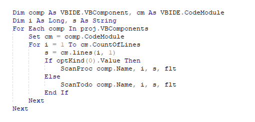
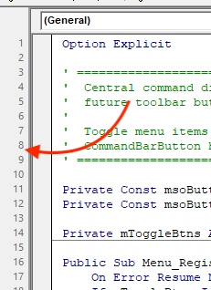
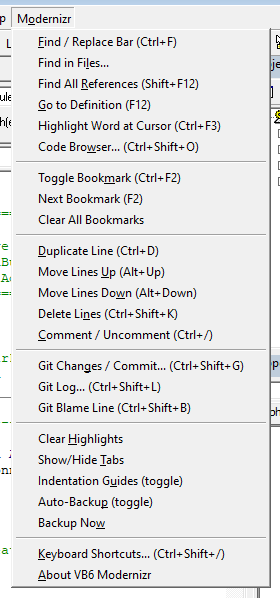

# VB6 Modernizr

A Visual Basic 6 IDE add-in, written in VB6 itself, that brings modern
editor conveniences to the classic IDE. No external dependencies:
everything uses the VB6 runtime, the extensibility library that ships
with VB6, Win32, and components present on every Windows install
(`VBScript.RegExp` for regex, `git.exe` on PATH for the git features,
PowerShell for backup zips).

## Features

### Window tabs
Browser-style tab bar above the code/designer area, drawn in the
classic VB6 3D look. Left click activates (windows are kept maximized
while tabs are on), middle click closes, drag reorders, right click
offers Close / Close Others / Close All / Copy Full Path / Open
Containing Folder. Tabs show a type glyph (blue = code, green =
designer), a `*` for unsaved changes, and an orange dot when the file
is modified vs git HEAD. The `▼` button lists every window when tabs
overflow; the right end shows the current git branch (`master *` when
dirty).



### Find / replace bar
A VS-style bar docked above the code area (Ctrl+F, prefilled from the
selection). Match case / whole word / regular expressions (with `$1`
group references in replacements); scopes: current module, selection,
open modules, whole project. Enter/Shift+Enter and F3/Shift+F3
navigate; Esc closes. **Highlight** outlines every match in the editor
and marks it on the vertical scrollbar (orange).



### Find in Files
Scans the codebase on disk — including designer sections of
`.frm`/`.ctl`/`.dsr` and project files — under the project folder or
any folder. Double-click jumps to the exact line (header offset
compensated); files outside the loaded project group open in Notepad.



### Navigation
Go to Definition (F12; several candidates open a results list),
Find All References (Shift+F12), Highlight Word at Cursor (Ctrl+F3),
persistent bookmarks (Ctrl+F2 toggle / F2 next; blue margin squares +
scrollbar marks; stored in `<project>.vbp.bookmarks` beside the .vbp
and re-anchored after edits via a line-text snapshot), a Code Browser
of procedures/TODOs with live filter (Ctrl+Shift+O), and a Ctrl+Tab
MRU window switcher (hold Ctrl, Tab cycles, release commits).

### Editing shortcuts
Duplicate line (Ctrl+D), move lines up/down (Alt+Up/Down), delete
lines (Ctrl+Shift+K), comment/uncomment (Ctrl+/). All work on the
selection, excluding a trailing line the selection only touches at
column 1 (VS convention).

### Git
Repo auto-detected from the project folder; everything shells out to
`git.exe` asynchronously (hidden process, output polled by a timer),
so the IDE never blocks. Status refreshes every ~5 s.

- **Changes window** (Ctrl+Shift+G): staged/unstaged lists with
  multi-select stage/unstage (selected or all); Commit commits the
  staged set; double-click opens the file.
- **Log** (Ctrl+Shift+L): `git log --graph` (git draws the graph) in
  a monospace list, optional all-branches; click a commit for its
  message + diffstat.


  
- **Blame** (Ctrl+Shift+B): commit/author/date/summary for the
  current line.
- **Changed-line markers**: margin bars (green = added, blue =
  modified, red = deletion below) and scrollbar marks, computed from
  `git diff -U0` against HEAD. Reflects the *saved* file.

### Extras
- **Mouse wheel scrolling** in code windows (Shift+wheel horizontal) —
  no need for Microsoft's separate MouseWheel fix.
- **Indentation guides** (menu toggle, default off): dotted vertical
  lines per indent step, bridging blank lines.



  
- **Line numbers** (menu toggle, default off): a real gutter strip is
  reserved left of the editor for maximized windows; floating windows
  fall back to small numbers in the indicator margin. These are
  code-module line numbers — the same numbering the IDE reports in
  error messages — not file lines (the designer block and `Attribute`
  headers only exist on disk, the editor never shows them).

  
  
- **Auto-backup** (menu toggle, default on): every 10 minutes, if
  project files changed, zips the project folder to
  `.backups\backup_<timestamp>.zip` (keeps the last 20) via a hidden
  PowerShell Compress-Archive. "Backup Now" forces one.

### Discoverability
Every command sits in the **Modernizr** menu with its shortcut in the
caption, and **Ctrl+Shift+/** opens a keyboard cheat sheet.



## Keyboard shortcuts

| Key | Action |
|---|---|
| Ctrl+F | Find / replace bar |
| F3 / Shift+F3 | Find next / previous |
| Ctrl+F3 | Highlight word at cursor everywhere |
| Esc | Close find bar / cancel switcher |
| F12 / Shift+F12 | Go to definition / find all references |
| Ctrl+F2 / F2 | Toggle bookmark / next bookmark |
| Ctrl+Shift+O | Code browser (procedures / TODOs) |
| Ctrl+Tab / Ctrl+Shift+Tab | MRU window switcher |
| Ctrl+D | Duplicate line / selection |
| Alt+Up / Alt+Down | Move lines up / down |
| Ctrl+Shift+K | Delete lines |
| Ctrl+/ | Comment / uncomment |
| Ctrl+Shift+G | Git changes / commit |
| Ctrl+Shift+L | Git log with graph |
| Ctrl+Shift+B | Git blame current line |
| Ctrl+Shift+/ | Shortcut cheat sheet |

Shortcuts only apply while focus is in a code window, so the IDE's own
bindings elsewhere are untouched. Two deliberate overrides in code
windows: F2 (normally Object Browser — still available via the View
menu) and Ctrl+Tab (normally plain MDI cycling). Shift+F2 (native
go-to-definition) is left alone as a fallback. Ctrl+/ is bound to the
physical `/` key of US-style layouts.

## Building

1. Open `VB6Modernizr.vbp` in VB6.
2. If references show as MISSING, re-check **Microsoft Visual Basic
   6.0 Extensibility** and **Microsoft Add-In Designer** under
   *Project → References*.
3. *File → Make VB6Modernizr.dll* (run VB6 as administrator once so
   COM registration succeeds). The Add-In Designer registers the
   add-in automatically at compile time.

## Installing / loading

1. Restart VB6, then *Add-Ins → Add-In Manager…* — select
   **VB6 Modernizr**, check *Loaded/Unloaded* and *Load on Startup*.
2. If it does not appear, add to `C:\Windows\vbaddin.ini`:

   ```ini
   [Add-Ins32]
   VB6Modernizr.Connect=1
   ```

To uninstall: unload it in the Add-In Manager, then
`regsvr32 /u VB6Modernizr.dll`.

## Files the add-in writes

- `HKCU\...\VB and VBA Program Settings\VB6Modernizr` — persisted
  options (guides on/off, backup on/off + last-backup time).
- `<project>.vbp.bookmarks` — bookmark sidecar, one per project.
- `<project folder>\.backups\` — rotated backup zips.

Recommended ignores for VB6 projects under git (this repo does both):
`.backups/` and `*.bookmarks` in `.gitignore`, plus a `.gitattributes`
forcing CRLF for VB6 sources and marking `*.frx` binary — VB6 cannot
load LF-normalized files.

## Development tips

- Don't run the add-in from a second IDE instance while a compiled
  copy is loaded — unload the compiled one first.
- The tab bar, find bar, highlight painting and wheel/keyboard
  handling rely on window subclassing and a WH_GETMESSAGE hook. All
  hooks are guarded with `On Error Resume Next` and removed on
  disconnect, but when hacking on those parts, test from a second VB6
  instance (F5) so a crash can't take your editor down.

## Known limitations

- Highlight/guide geometry is calibrated empirically (registry font +
  margin heuristic). Horizontal editor scrolling isn't detectable, so
  overlays assume the view starts at column 1; real tab characters in
  source lines shift positions.
- Highlights go stale while editing until re-run (VS clears on edit
  too); regex works per line (no multi-line patterns).
- Git line markers and backups reflect files as *saved on disk*, not
  unsaved editor buffers.
- Unstaging uses `git reset HEAD` (works on any git); in a brand-new
  repo with zero commits it's a no-op until the first commit exists.
- Tab drag-reorder is per-session; order resets on IDE restart.
